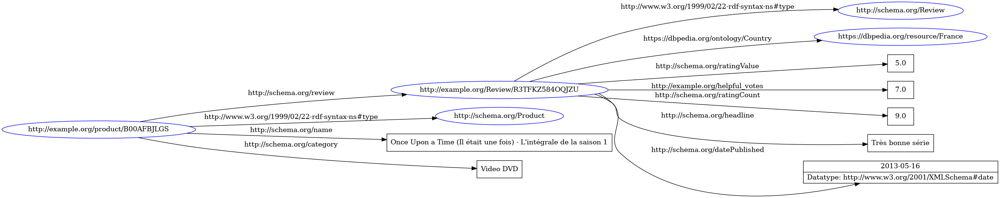

# LINK ALL THE DATA
### Semantic Web Project

[Link to the diapo](https://docs.google.com/presentation/d/17ujsVmwEoxKzDSSzz7CoVLtgLVd3hdcQStUgbiQ9YqY/edit#slide=id.p)

Objectives:
 - [x] Find an interesting dataset that can be linked with others
 - [x] Transform it into an RDF format (an RDF graph)
 - [ ] Executes some sparql requests on it, preferably interesting ones
 - [ ] Make some sparql requests that link another RDF graph, preferably interesting ones
 - [ ] Make a sparql requests that link to the maximum number of RDF graphs possible

## Dataset presentation



[**Original dataset**](Link to the index](https://s3.amazonaws.com/amazon-reviews-pds/tsv/index.txt)): Amazon product reviews in uk, france, japan, germany, us

You can use the download.bat file in ./dataset to download all the dataset (total size about 2gb)

In order to handle a smaller (more manageable) dataset, a python script [knife.py](https://github.com/happy44300/projet-web-semantique/blob/main/knife.py) 
was created in the dataset folder. It was used to take a sample of the original dataset and to remove some columns: product_parent, customer_id, vine, verified_purchase
To use it, simply execute the python file in the same folder as the original dataset (not renamed). Since it open all the dataset it might need more than 8gb of ram to execute.
It requires the pandas library.

The samples created are called n_review_sample_csv where n is the number of review in the sample. 
Example: [1_review_sample.csv](https://github.com/happy44300/projet-web-semantique/blob/main/review_sample.csv), has 1 review and 11 columns.


## Transformation to RDF format (turtle)

To transform this dataset into an RDF format, the tool tarql was used. The script [tarqlerun.sparql](https://github.com/happy44300/projet-web-semantique/blob/main/tarqlerun.sparql) is used with tarql and transforms the data of [review_sample.csv](https://github.com/happy44300/projet-web-semantique/blob/main/review_sample.csv) into an RDF format (turtle by default).

Command to run our tarql script and save the results into a file (ntriples format):
```bash
..\tarql-1.2\bin\tarql --ntriples --encoding "utf-8" ..\tarqlerun.sparql .\500000_review_sample.csv > 500000_review_sample.nt
..\tarql-1.2\bin\tarql --ntriples --encoding "utf-8" ..\tarqlerun.sparql .\100000_review_sample.csv >100000_review_sample.nt
..\tarql-1.2\bin\tarql --ntriples --encoding "utf-8" ..\tarqlerun.sparql .\50000_review_sample.csv >50000_review_sample.nt
..\tarql-1.2\bin\tarql --ntriples --encoding "utf-8" ..\tarqlerun.sparql .\10000_review_sample.csv >10000_review_sample.nt
```

This results in the file [n_review_sample.ttl](https://github.com/happy44300/projet-web-semantique/blob/main/review_sample.ttl) containing the data of the sample, but in an RDF format (turtle). This file will be used as the RDF graph for the upcoming sparql requests.


## Group members

Houda Bouferis - Adrien Lesénéchal - Malo Le Reste - Bilal Molli
